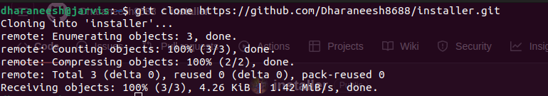
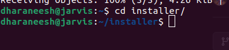
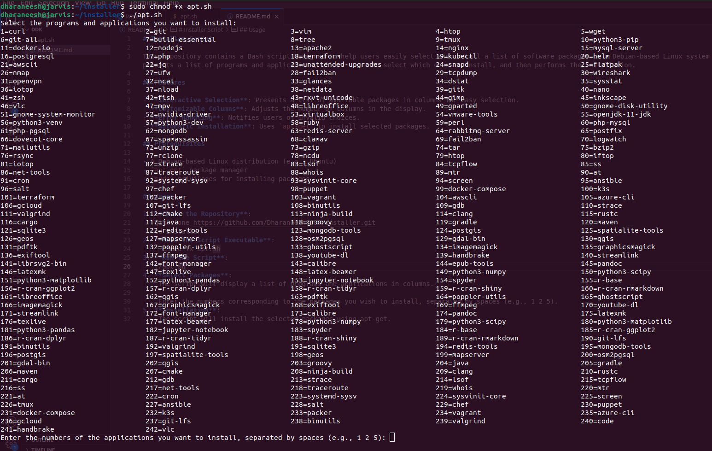

# Installer Script

This repository contains a Bash script designed to help users easily select and install a list of software packages on a Debian-based Linux system (e.g., Ubuntu). The script presents a list of programs and applications, allows users to select which ones to install, and then performs the installation.

## Features

- **Interactive Selection**: Presents a list of available packages in columns for easy selection.
- **Customizable Columns**: Adjusts the number of columns in the display.
- **Error Handling**: Notifies users of invalid choices.
- **Automatic Installation**: Uses `apt-get` to install selected packages.

## Prerequisites

- A Debian-based Linux distribution (e.g., Ubuntu)
- `apt-get` package manager
- `sudo` privileges for installing packages

## Usage

1. **Clone the Repository**:
   git clone https://github.com/Dharaneesh8688/installer.git
   cd installer

   
2. **Make the Script Executable**:
     chmod +x apt.sh
3. **Run the Script**:
   ./apt.sh

   
4. **Select Packages**:
    The script will display a list of programs and applications in columns.

    Enter the numbers corresponding to the packages you wish to install, separated by spaces (e.g., 1 2 5).

    
       
5. **Installation**:
    The script will install the selected packages using apt-get.

   